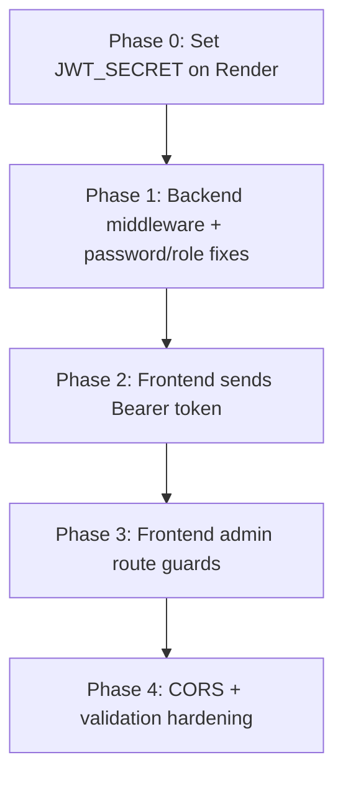

# Afrilink Hub — Security Upgrade Plan

> **Status:** Planning document only — no code has been changed yet.  
> **Goal:** Secure the application without breaking existing public marketplace flows (browse products, submit requests, WhatsApp contact, login/register).

---

## Executive summary

The app issues JWTs on login but **never validates them on the backend**. All write operations (products, requests, quotations) and most read operations (all requests) are **fully public**. Admin protection exists only as **client-side UI checks** that inspect `localStorage` and can be bypassed with a direct API call or by visiting a URL.

This plan introduces **server-side authorization first** (the real security boundary), then **frontend token usage and route guards** (UX and defense in depth), then **password and role hardening**. Changes are phased so each step can be deployed and tested independently.

**Guiding principle (from `AFRILINK_CONTEXT.md`):** Make small, safe changes. Do not delete working code. Preserve public buyer flows.

---

## Current architecture (security-relevant)

| Layer | Current behavior |
|-------|------------------|
| Backend | Express on Render; no auth middleware; CORS open to all origins |
| Frontend | Next.js App Router; token in `localStorage`; `apiFetch` never sends `Authorization` |
| Session | JWT stored client-side for 7 days; user object duplicated in `localStorage` |
| Roles | `buyer`, `supplier`, `admin` in MongoDB; role trusted from client on register |

---

## 1. JWT implementation — analysis

### Current state

**Issuance** (`backend/server.js`, login handler):

- Token payload: `{ id: user._id, role: user.role }`
- Secret: hardcoded string `"SECRET_KEY"` (not from environment)
- Expiry: `7d`
- Algorithm: default HS256 (jsonwebtoken)

**Storage** (`frontend/app/login/page.tsx`):

- `localStorage.setItem("token", data.token)`
- `localStorage.setItem("user", JSON.stringify(data.user))`

**Usage:**

- Token is **never sent** on subsequent API requests
- No `jwt.verify()` anywhere in the backend
- No Next.js middleware file exists
- Role checks on the home page and dashboard read `localStorage` only

### Risks

| Risk | Severity |
|------|----------|
| Hardcoded JWT secret — anyone can forge tokens if source is known | **Critical** |
| Tokens unused — auth system provides false sense of security | **Critical** |
| Role embedded in JWT — if secret leaks, attackers can mint admin tokens | **High** |
| `localStorage` — vulnerable to XSS token theft | **Medium** |
| No token refresh or revocation | **Low** (acceptable for v1) |

### Target state

1. JWT secret loaded from `process.env.JWT_SECRET` (required at startup)
2. Shared middleware: `authenticate` (verify token) and `authorize(...roles)` (check role)
3. Frontend `apiFetch` automatically attaches `Authorization: Bearer <token>` when token exists
4. Optional Phase 2: move token to `httpOnly` cookie for XSS resistance (not required for initial upgrade)

### Preservation notes

- Login response shape stays `{ success, token, user }` so existing login page continues to work
- 7-day expiry can remain unchanged initially
- Payload fields `id` and `role` are sufficient for authorization

---

## 2. Admin route protection — analysis

### Current state

**Frontend routes that should be admin-only:**

| Route | Current guard |
|-------|---------------|
| `/admin/products` | Token present only (any logged-in user) |
| `/admin/products/create` | **None** |
| `/admin/products/[id]/edit` | **None** |
| `/requests` | Token present only; toast says "Admin login required" but role not checked |
| `/requests/[idi]/edit` | **None** |
| `/dashboard` | Token present only (all roles allowed — correct for dashboard) |

**Public routes (must stay public):**

- `/`, `/products`, `/products/[id]`, `/post-request`, `/contact`, `/login`, `/register`

**Role-gated routes (non-admin):**

- `/requests/[idi]/quote` — supplier workflow; currently **no guard**

### Risks

| Risk | Severity |
|------|----------|
| Admin pages render without login; only API calls would fail after backend fix | **High** (UX) / **Critical** (API) |
| Non-admin users see admin nav if they tamper with `localStorage` user JSON | **Medium** |
| Client-only guards are bypassable — must not be the only control | **Critical** |

### Target state

**Layer 1 — Backend (mandatory):** Admin API routes reject non-admin tokens regardless of frontend.

**Layer 2 — Frontend (UX):**

- Shared hook or utility: `getAuthUser()`, `requireRole("admin")`
- Admin pages redirect to `/login` if no token, or `/dashboard` if wrong role
- Home nav admin links already check `user.role === "admin"` — extend same pattern to all admin pages

**Layer 3 — Optional Next.js middleware (Phase 2):**

- Requires moving token to cookie; middleware can then protect `/admin/*` and `/requests/*` server-side
- Defer until cookie migration to avoid false confidence from middleware that cannot read `localStorage`

### Preservation notes

- Buyers and suppliers still access `/dashboard` after login
- Public product browsing and anonymous `/post-request` unchanged
- Admin users keep full access to product CRUD and request management

---

## 3. Backend authorization — analysis

### Current state

No middleware between `express.json()` and route handlers. Every endpoint is unauthenticated.

### Risks

All mutating endpoints are callable by anyone with curl or Postman:

```bash
# Examples of what works today without any token
curl -X POST https://afrilinkcapital.onrender.com/products -d '{...}'
curl -X DELETE https://afrilinkcapital.onrender.com/products/<id>
curl -X PUT https://afrilinkcapital.onrender.com/requests/<id> -d '{"status":"Delivered"}'
```

### Target state

Add `backend/middleware/auth.js` with:

```js
// authenticate — verifies JWT, attaches req.user = { id, role }
// authorize("admin") — returns 403 if role not allowed
// optionalAuth — verifies token if present, continues if absent (for future use)
```

Apply middleware **per route**, not globally, to preserve public endpoints.

### Preservation notes

- Public GET product endpoints remain open (marketplace showroom)
- Public POST `/requests` remains open (anonymous quotation requests)
- Public POST `/register` and `/login` remain open

---

## 4. User role security — analysis

### Current state

**Registration** (`POST /register`):

- Accepts `role` from request body
- Client UI only offers `buyer` and `supplier`
- API accepts any enum value including `admin` if sent manually

**Authorization model:**

- Roles stored in DB and copied into JWT at login
- No server-side enforcement of role permissions
- `localStorage` user object is client-editable (UI trust only)

**User model** (`backend/models/User.js`):

- Roles: `buyer`, `supplier`, `admin` (enum)
- Default: `buyer`

### Risks

| Risk | Severity |
|------|----------|
| Self-registration as `admin` via API | **Critical** |
| JWT role could drift from DB if user role changed after login | **Low** (re-login fixes; document behavior) |
| Supplier role has no meaningful server-side restrictions on quotations | **Medium** |

### Target state

1. **Registration:** Ignore client-supplied `role` for self-signup; always assign `buyer` (or `supplier` if selected from allowed list — never `admin`)
2. **Admin creation:** Only via manual DB seed, protected admin-only endpoint (future), or migration script — not public register
3. **Authorization matrix:** Enforce on every protected route (see Section 5)
4. **JWT payload:** Keep `role` for authorization; on role change in DB, user must re-login (document this)

### Preservation notes

- Register page still offers Buyer / Supplier choice
- Existing admin accounts in MongoDB continue to work after login
- No mass role migration required unless admin accounts were created via exploit

---

## 5. API endpoint security — analysis

### Current endpoint matrix

| Method | Endpoint | Current access | Intended access |
|--------|----------|------------------|-----------------|
| GET | `/` | Public | Public |
| POST | `/register` | Public | Public |
| POST | `/login` | Public | Public |
| GET | `/products` | Public | Public |
| GET | `/products/:id` | Public | Public |
| POST | `/products` | **Public** | **Admin** |
| PUT | `/products/:id` | **Public** | **Admin** |
| DELETE | `/products/:id` | **Public** | **Admin** |
| POST | `/requests` | Public | Public (anonymous buyer requests) |
| GET | `/requests` | **Public** | **Admin** |
| GET | `/requests/:id` | **Public** | **Admin** (buyer-scoped later) |
| PUT | `/requests/:id` | **Public** | **Admin** |
| DELETE | `/requests/:id` | **Public** | **Admin** |
| POST | `/quotations` | **Public** | **Supplier or Admin** |

### Additional API issues (security-adjacent)

- **Mass assignment:** `POST /requests` spreads `req.body` — caller can set `status` to any value
- **Mass assignment:** `POST /products` passes full `req.body` without field allowlist
- **Information disclosure:** `GET /requests` exposes all buyer requests to the world
- **Mixed HTTP/HTTPS:** Some frontend pages call `http://afrilinkcapital.onrender.com` — fix during frontend auth pass (not strictly auth, but deployment risk)
- **CORS:** `app.use(cors())` allows all origins — tighten to frontend origin(s) in Phase 4

### Target middleware assignment

```
Public (no middleware):
  GET  /, /products, /products/:id
  POST /register, /login, /requests

authenticate + authorize("admin"):
  POST   /products
  PUT    /products/:id
  DELETE /products/:id
  GET    /requests
  GET    /requests/:id
  PUT    /requests/:id
  DELETE /requests/:id

authenticate + authorize("supplier", "admin"):
  POST /quotations
```

### Future (not in initial upgrade — document only)

- `GET /requests/mine` for buyers (authenticate + authorize("buyer"))
- Link `Request.userId` to authenticated buyer; keep anonymous POST with optional auth
- `GET /quotations` for admin review

---

## 6. Password handling — analysis

### Current state

**Hashing:**

- Registration uses `bcrypt.hash(password, 10)` — **correct**
- Login uses `bcrypt.compare(password, user.password)` — **correct**

**Exposure:**

- `POST /register` returns full `user` document including `password` hash
- `POST /login` returns full `user` document including `password` hash
- Mongoose returns all fields by default; no `select: false` on password field

**Validation:**

- No minimum password length on backend or frontend
- No email format validation beyond HTML `type="email"` on login
- Login returns `"User not found"` vs `"Invalid password"` — enables email enumeration (minor)

**Storage:**

- Password field has no `select: false` in schema — any future User query leaks hashes

### Risks

| Risk | Severity |
|------|----------|
| Password hash returned in API responses | **High** |
| Weak passwords allowed | **Medium** |
| Email enumeration on login | **Low** |

### Target state

1. Add `select: false` to password field in User schema
2. Use `.select("-password")` explicitly on login/register responses (or `toJSON` transform)
3. Add backend validation: minimum 8 characters (align with frontend)
4. Unify login error message: `"Invalid email or password"` for both not-found and wrong-password
5. Never log passwords or tokens

### Preservation notes

- Existing bcrypt hashes remain valid — no password reset migration needed
- Login/register forms unchanged except optional min-length hint on register

---

## Step-by-step implementation plan

Each phase is independently deployable. **Deploy backend phases before or together with frontend phases** that send tokens, to avoid locking out admins mid-rollout.

---

### Phase 0 — Preparation (no behavior change)

**Backend**

1. Add `JWT_SECRET` to Render environment variables (strong random string, 32+ bytes).
2. Add `FRONTEND_URL` (e.g. `https://your-app.vercel.app`) for future CORS.
3. Document required env vars in `backend/.env.example` (do not commit real secrets).

**Verification**

- [ ] Backend starts only when `JWT_SECRET` is set (add check in Phase 1).
- [ ] Existing deployment still works before Phase 1 ships.

---

### Phase 1 — Backend auth foundation

**Files to add/modify**

- Add `backend/middleware/auth.js`
- Modify `backend/server.js`

**Steps**

1. Create `authenticate` middleware:
   - Read `Authorization: Bearer <token>` header
   - Verify with `jwt.verify(token, process.env.JWT_SECRET)`
   - Attach `req.user = { id, role }` from payload
   - Return `401` with `{ success: false, message: "Unauthorized" }` on failure

2. Create `authorize(...allowedRoles)` middleware:
   - Require `req.user` exists
   - Return `403` if `req.user.role` not in allowed roles

3. Replace hardcoded `"SECRET_KEY"` with `process.env.JWT_SECRET` in login handler.

4. Apply middleware to routes per matrix in Section 5:
   - **Do not** add middleware to public routes yet unchanged: GET products, POST requests, register, login.

5. Strip password from auth responses:
   - User schema: add `select: false` on password field
   - Register/login: query with `.select("-password")` or delete before `res.json`

6. Harden registration role:
   - Replace `role` from body with: `const role = ["buyer", "supplier"].includes(req.body.role) ? req.body.role : "buyer"`
   - Never accept `admin` from public register

7. Fix request mass assignment on `POST /requests`:
   - Allowlist fields: `title`, `description`, `quantity`, `country` only
   - Force `status: "Received"` server-side (ignore client status)

**Verification**

- [ ] Public GET `/products` works without token
- [ ] Public POST `/requests` works without token
- [ ] POST `/products` without token returns 401
- [ ] POST `/products` with buyer token returns 403
- [ ] POST `/products` with admin token succeeds
- [ ] Login/register responses do not include `password`
- [ ] Register with `role: "admin"` creates buyer or supplier, not admin

**Rollback:** Remove middleware from routes; revert to open API (not recommended once deployed).

---

### Phase 2 — Frontend token transmission

**Files to modify**

- `frontend/src/lib/api.ts`
- All pages using raw `fetch()` to backend (admin products, requests, edit, quote, home featured products can stay public GET)

**Steps**

1. Enhance `apiFetch`:
   - Read token from `localStorage.getItem("token")` when in browser
   - Add `Authorization: Bearer ${token}` when token exists
   - Check `res.ok`; throw or return structured error on 401/403
   - On 401: clear token/user and redirect to `/login` (optional, improves UX)

2. Replace direct `fetch()` calls to backend with `apiFetch()` on **authenticated** operations:
   - Admin product list/delete/edit/update
   - Request list/detail/edit
   - Quotation submit
   - Keep public GET `/products` as-is (no token required)

3. Standardize all API URLs to HTTPS via `API_URL` constant (fix `http://` usage on request pages).

4. Add `NEXT_PUBLIC_API_URL` env var (default to current Render URL) so local dev can point to localhost.

**Verification**

- [ ] Admin can create/edit/delete products while logged in
- [ ] Logged-out admin actions show clear error / redirect
- [ ] Public product pages still load without login
- [ ] Anonymous post-request still works

---

### Phase 3 — Frontend admin route guards

**Files to add/modify**

- Add `frontend/src/lib/auth.ts` (helpers: `getToken`, `getUser`, `isAdmin`, `requireAuth`, `requireAdmin`)
- Modify admin pages and request management pages

**Steps**

1. Create shared auth helpers reading from `localStorage` (same storage keys — no breaking change).

2. Add guards to admin pages on mount:
   - `/admin/products`, `/admin/products/create`, `/admin/products/[id]/edit`
   - `/requests`, `/requests/[idi]`, `/requests/[idi]/edit`
   - Redirect to `/login` if no token; redirect to `/dashboard` with toast if token but not admin

3. Add guard to `/requests/[idi]/quote`:
   - Require supplier or admin role

4. Align `/requests` page messaging: check `user.role === "admin"` explicitly (not just token).

5. Do **not** remove buyer link to `/requests` on dashboard yet — either hide for buyers or plan Phase 5 for buyer-scoped requests.

**Verification**

- [ ] Non-admin logged-in user visiting `/admin/products` is redirected
- [ ] Unauthenticated user visiting admin routes goes to login
- [ ] Admin workflow unchanged when logged in as admin
- [ ] Direct API calls without token still blocked (Phase 1)

---

### Phase 4 — Hardening and cleanup

**Backend**

1. Restrict CORS:
   ```js
   cors({ origin: process.env.FRONTEND_URL, credentials: true })
   ```
   Add localhost for development via env list if needed.

2. Allowlist `POST /products` and `PUT /products/:id` body fields (fix duplicate `image` key bug; include `video` in update).

3. Add basic rate limiting on `/login` and `/register` (e.g. `express-rate-limit`) — optional but recommended.

4. Return consistent error shapes; avoid leaking stack traces in production.

**Frontend**

1. Register page: add `minLength={8}` on password input; match backend rule.

2. Remove duplicate `WhatsAppButton` on home page (layout already renders it) — minor, not security-critical.

3. Update `layout.tsx` metadata from default Next.js placeholder.

**Verification**

- [ ] Frontend on Vercel can call API (CORS not blocking)
- [ ] Brute-force login slightly throttled
- [ ] Product update persists video field

---

### Phase 5 — Future enhancements (out of scope for initial upgrade)

Document for later; not required to secure the app today:

| Enhancement | Purpose |
|-------------|---------|
| `httpOnly` cookie for JWT | Reduce XSS token theft |
| Next.js `middleware.ts` | Server-side route protection (needs cookies) |
| `Request.userId` + buyer endpoints | Scoped "my requests" without exposing all requests |
| Admin user management API | Create/promote admins safely |
| Password reset flow | Operational necessity |
| Refresh tokens | Shorter access token lifetime |
| Audit log for admin actions | Compliance and debugging |
| Helmet.js | HTTP security headers |

---

## Files changed summary (all phases)

| File | Phase | Change |
|------|-------|--------|
| `backend/middleware/auth.js` | 1 | **New** — authenticate, authorize |
| `backend/server.js` | 1, 4 | JWT secret, middleware, role fix, field allowlists |
| `backend/models/User.js` | 1 | `select: false` on password |
| `backend/.env.example` | 0 | **New** — document env vars |
| `frontend/src/lib/api.ts` | 2 | Bearer token, error handling, env URL |
| `frontend/src/lib/auth.ts` | 3 | **New** — client auth helpers |
| `frontend/app/admin/**/*.tsx` | 2, 3 | apiFetch + role guards |
| `frontend/app/requests/**/*.tsx` | 2, 3 | apiFetch + role guards |
| `frontend/app/register/page.tsx` | 4 | Password min length |

**Not deleted:** Existing pages, models, or public flows.

---

## Deployment order



1. Set `JWT_SECRET` on Render **before** deploying Phase 1.
2. Deploy backend Phase 1 — public marketplace still works; admin must use token after Phase 2.
3. Deploy frontend Phases 2 + 3 together or back-to-back so admins are not blocked.
4. Phase 4 when stable.

---

## Testing checklist (end-to-end)

### Public flows (must still work)

- [ ] Browse `/products` without login
- [ ] View `/products/[id]` without login
- [ ] Submit `/post-request` without login
- [ ] WhatsApp links work
- [ ] Register as buyer and supplier
- [ ] Login redirects admin to dashboard, others to home

### Security flows (must be blocked)

- [ ] Unauthenticated POST `/products` → 401
- [ ] Buyer token POST `/products` → 403
- [ ] Unauthenticated GET `/requests` → 401
- [ ] Unauthenticated PUT `/requests/:id` → 401
- [ ] Register with `role: admin` in body → user is not admin
- [ ] Login/register response has no password field

### Admin flows (must still work with admin token)

- [ ] Create product with Cloudinary upload
- [ ] Edit and delete product
- [ ] List and search requests
- [ ] Edit request status
- [ ] View request detail

### Supplier flows

- [ ] Supplier can POST quotation when authenticated
- [ ] Anonymous POST quotation → 401 (after Phase 1)

---

## Environment variables

| Variable | Where | Required | Purpose |
|----------|-------|----------|---------|
| `MONGO_URI` | Backend | Yes | Database (existing) |
| `JWT_SECRET` | Backend | Yes (Phase 1+) | Sign and verify JWTs |
| `FRONTEND_URL` | Backend | Phase 4 | CORS allowlist |
| `NEXT_PUBLIC_API_URL` | Frontend | Optional | API base URL override |
| `NEXT_PUBLIC_CLOUDINARY_*` | Frontend | Existing | Media upload |

---

## Risk if plan is not implemented

Anyone on the internet can currently:

- Create, modify, or delete all products in the showroom
- Read all buyer procurement requests (PII: countries, quantities, descriptions)
- Change request status to "Delivered" or delete requests
- Register an admin account via direct API call
- Forge JWTs if they know the hardcoded secret `"SECRET_KEY"`

Securing the backend (Phase 1) addresses the critical exposure. Frontend phases improve UX and reduce accidental misuse but **cannot replace server-side authorization**.

---

## Recommended first implementation PR

**Smallest high-impact slice:** Phase 0 + Phase 1 only.

- Adds real security at the API boundary
- Does not require frontend changes for public users
- Admin frontend will need Phase 2 immediately after so admins can continue working with a browser session

After Phase 1 ships, Phase 2 should follow within the same release window to avoid admin lockout.
